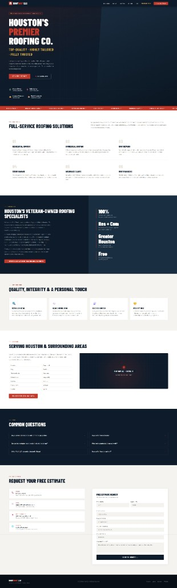

# RoofRoofTexas.com — Full Website Rebuild

**Complete redesign, re-architecture, security hardening, and local SEO overhaul for a Houston roofing company — built lean on purpose.**

## Before / After

| Before | After |
|:---:|:---:|
|  |  |

---

## Scope of Work

A ground-up rebuild that kept the smart architectural bet — a fast static one-pager with a thin PHP backend — and rebuilt everything on top of it:

- **Design system** — brand-aligned navy/red palette, typography scale, SVG icon sprite (replacing emoji icons), consistent card and section language
- **Real proof content** — project gallery with responsive photography and aerial video flyovers (the original had no portfolio at all)
- **Live service-area map** — interactive map covering 14 Greater Houston cities (replacing a CSS placeholder graphic)
- **Conversion-focused estimate form** — semantic, accessible, and hardened against spam and abuse end to end
- **Media pipeline** — automated optimization turning 3–358 MB source photos and 4K drone video into sub-2 MB web deliverables
- **Mobile experience** — fully responsive navigation (the original hid its nav entirely below 768px with no fallback)
- **Accessibility** — skip links, ARIA landmarks, keyboard-operable accordion, reduced-motion and save-data video gating, WCAG 2.2.2 media pause control
- **Server hardening + SEO infrastructure** — detailed below

## Before vs After

| Axis | Before | After |
|---|---|---|
| **Architecture** | Monolithic HTML, 3 deployed files | Modular asset structure, cache-split deliverables, plugin-style JS |
| **Visual proof** | No gallery, CSS-only hero | Photo gallery + video flyovers, video hero with poster |
| **Mobile nav** | Hidden below 768px — dead end | Fully responsive with click-to-call CTA |
| **Icons** | Emoji characters | Inline SVG sprite, theme-aware |
| **Map** | Decorative CSS pin | Live interactive map, lazy-loaded, integrity-pinned CDN |
| **Media** | None shipped | Responsive WebP/JPEG at 3 widths + compressed MP4 loops |
| **Form security** | Client-side `alert()` validation only | CSRF, honeypot, rate limiting, origin checks, server-side sanitization |
| **Security headers** | None | CSP, HSTS, nosniff, frame, referrer, permissions policies |
| **SEO artifacts** | Sitemap/OG image referenced but never deployed | Shipped sitemap, robots, llms.txt, full structured data graph |
| **Accessibility** | Non-semantic contact block, no skip link | Semantic form, ARIA throughout, motion/data-aware media |

## Security Enhancements

**Form layer** (every measure server-side — no third-party CAPTCHA dependency):

- Session-based **CSRF tokens** with one-time rotation on successful submit
- **Honeypot field** — bots receive silent success and go nowhere
- **Minimum-delay check** — submissions faster than a human can type are rejected
- **Per-IP rate limiting** on the mail endpoint
- **Origin/Referer whitelisting** to the production domain
- Strict input handling: tag stripping, entity escaping, length caps, phone format validation, property-type whitelist, email validation
- **Mail header injection stripping** (CR/LF/null) before any message is composed
- Hardened session cookies: `HttpOnly`, `SameSite=Strict`, `Secure`

**Server layer** (`.htaccess` on shared hosting):

- Forced HTTPS with permanent redirects
- **Content-Security-Policy**, **HSTS** (1 year, subdomains), `X-Frame-Options`, `X-Content-Type-Options: nosniff`, `Referrer-Policy`, `Permissions-Policy`
- Directory listing disabled, hidden-file access blocked
- **PHP execution blocked under the assets tree**
- Query-string filtering against common XSS/SQLi probe patterns
- HTTP method restrictions per endpoint (the token issuer is GET-only, the mail handler POST-only)
- Form endpoints excluded from crawling via robots rules

## SEO Enhancements

**Structured data — a full JSON-LD `@graph`:**

- `RoofingContractor` — NAP, business hours, `areaServed` across 14 Houston-area cities, service catalog, `sameAs` profile links
- `FAQPage` — mirrors the on-page FAQ accordion for rich results
- `VideoObject` (×2) — hero and project flyover videos
- `ItemList` of project `ImageObject`s
- `WebSite` + `WebPage` with `speakable` selectors and a contact `ContactAction`

**Local SEO:** geo meta tags (Houston coordinates), city-by-city service-area content, consistent NAP, Open Graph + Twitter Card metadata, canonical URL, tuned robots directives.

**Discovery files:** `sitemap.xml`, `robots.txt` welcoming both search and AI crawlers (with dev paths and form endpoints disallowed), and `llms.txt` — an AI-readable business brief with citation guidance, linked via `rel="alternate"`. The original site *referenced* a sitemap that was never actually deployed; the rebuild ships all of it.

**Image SEO:** keyword-rich alt text, responsive `srcset`/`sizes` at 480/960/1600w, WebP with JPEG fallback.

## Performance

- **Asset pipeline** — automated resize/transcode workflow: multi-MB photos and 4K drone footage compressed to sub-2 MB WebP/MP4 deliverables, idempotent rebuilds
- **LCP** — hero poster preloaded with `fetchpriority="high"`; `preconnect`/`dns-prefetch` for the few external origins
- **CLS** — explicit dimensions on all media
- **Lazy everything below the fold** — images, videos, and the map only load when needed; video respects reduced-motion, save-data, and slow-connection signals
- **Caching** — 1-year immutable cache on media, compression on text, no-cache on HTML so content updates land instantly

---

*Case study by [Joseph Edwards (GatoGodMode)](https://github.com/GatoGodMode) — developer of CRMs, capture platforms, and business solutions for construction, solar, and roofing. The production site is live at [roofrooftexas.com](https://roofrooftexas.com); this repo documents the work and contains no client credentials or private data.*
